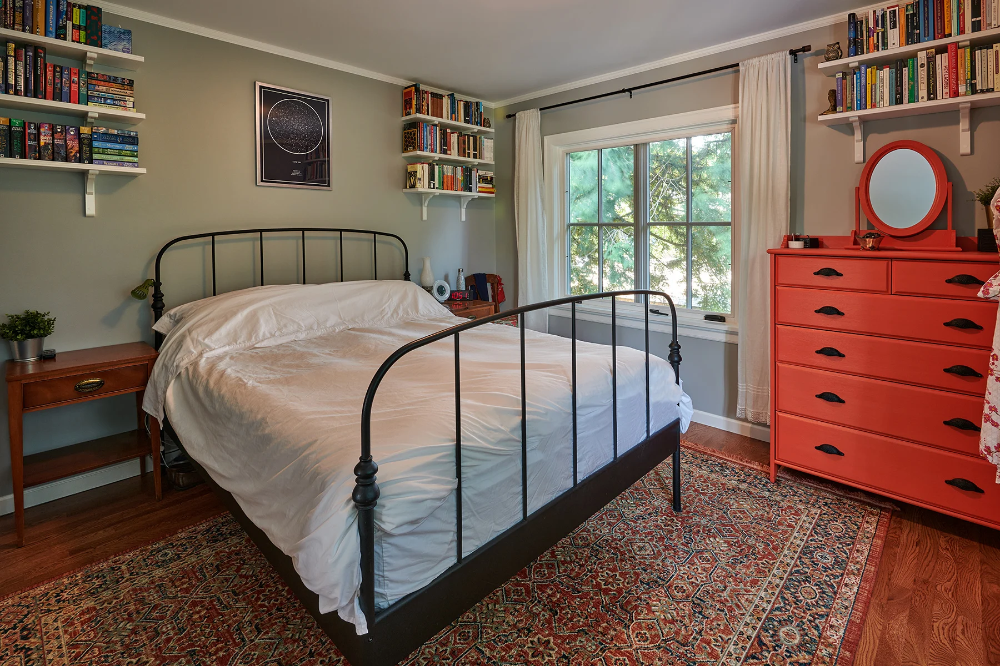

# DeClutter - AI-Powered Interior Design Transformation

 <!-- Add a banner image later -->

**Capstone Graduation Project | CMSE 405 | Fall 2025-26**

DeClutter is an AI-powered interior design application that transforms room photographs into customized design styles using deep learning. Upload a photo of your room and instantly visualize it in different aesthetic styles with budget-aware furniture recommendations.

---

##  Features

###  **Style Transformations**
Transform your space into any of these design aesthetics:
- **Minimalist** - Clean, simple, clutter-free
- **Boho** - Eclectic, colorful, artistic
- **Industrial** - Raw, exposed materials, urban
- **Modern** - Contemporary, sleek, functional
- **Scandinavian** - Light, natural, cozy

###  **Supported Room Types**
- Bathrooms
- Bedrooms
- Kitchens
- Living Rooms

###  **AI Technologies**
- **CycleGAN**: Style transfer and room transformation
- **YOLOv8**: Object detection for furniture identification
- **Budget Estimation**: AI-powered cost analysis for redesign

---

##  Team

| Name | Role | Responsibilities |
|------|------|------------------|
| **Mohamed Elfaki** | AI/ML Lead | CycleGAN implementation, YOLO integration, model training |
| **Firas Nazar** | Backend Lead | API development, database, cloud deployment |
| **Saad Ahmed** | Frontend Lead | React web application, UI/UX design |
| **Ahmed Salmi** | Mobile & Integration | React Native app, system integration |

**Supervisor:** Prof. Dr. Hakan Altunçay  
**Institution:** Eastern Mediterranean University  
**Course:** CMSE 405 - Software Design & Development  
**Timeline:** October 2025 - June 2026

---

##  Quick Start

### Prerequisites
- Python 3.8+
- PyTorch 1.12+
- Node.js 16+ (for frontend)
- 8GB+ RAM
- GPU recommended for training

### Installation

**1. Clone the repository**
```bash
git clone https://github.com/your-username/declutter-ai.git
cd declutter-ai
```

**2. Setup Python environment**
```bash
python -m venv venv
source venv/bin/activate  # On Windows: venv\Scripts\activate
pip install -r requirements.txt
```

**3. Download dataset** (See [Dataset Setup](#dataset-setup))

**4. Clone CycleGAN implementation**
```bash
git clone https://github.com/junyanz/pytorch-CycleGAN-and-pix2pix.git
cd pytorch-CycleGAN-and-pix2pix
pip install -r requirements.txt
```

---

## 📊 Dataset Setup

**Source:** [Interior Design Style Dataset]([https://www.kaggle.com/datasets/...](https://www.kaggle.com/datasets/galinakg/interior-design-images-and-metadata)) on Kaggle

**Structure:**
```
dataset/
├── trainA/          # Source style rooms (400+ images)
├── trainB/          # Target style rooms (150+ images)
├── testA/           # Test source rooms (50 images)
└── testB/           # Test target rooms (50 images)
```

**To setup:**
```bash
# 1. Download from Kaggle
# 2. Extract to project folder
# 3. Run organization script
python scripts/organize_dataset.py

# 4. Verify dataset
python scripts/verify_dataset.py
```

**Note:** Dataset images (~2GB) are NOT included in this repository. Download from Kaggle link above.

---

##  Training

### Train CycleGAN Model
```bash
cd pytorch-CycleGAN-and-pix2pix

# Train for minimalist transformation
python train.py \
    --dataroot ../dataset/minimalist \
    --name bedroom_minimalist \
    --model cycle_gan \
    --batch_size 1 \
    --n_epochs 100 \
    --n_epochs_decay 100 \
    --gpu_ids 0

# Monitor training
tensorboard --logdir checkpoints/bedroom_minimalist
```

**Training time:** 24-48 hours on GPU

### Train YOLO Model (Object Detection)
```bash
cd src/yolo
python train_yolo.py --data room_furniture.yaml --epochs 100
```

---

##  Testing

### Test Style Transfer
```bash
cd pytorch-CycleGAN-and-pix2pix

python test.py \
    --dataroot ../dataset/minimalist/testA \
    --name bedroom_minimalist \
    --model cycle_gan \
    --num_test 50

# Results saved to: results/bedroom_minimalist/test_latest/
```

### Evaluate Performance
```bash
python scripts/evaluate_model.py \
    --results_dir results/bedroom_minimalist/test_latest \
    --metrics fid ssim lpips
```

---

##  Running the Application

### Backend API
```bash
cd backend
python app.py

# API runs on http://localhost:5000
```

### Frontend (Web)
```bash
cd frontend
npm install
npm start

# Web app runs on http://localhost:3000
```

### Mobile App
```bash
cd mobile
npm install
npx react-native run-android  # or run-ios
```

---

##  Project Structure
```
declutter-ai/
├── dataset/                      # Dataset (NOT in Git)
│   ├── trainA/, trainB/
│   └── testA/, testB/
├── pytorch-CycleGAN-and-pix2pix/ # CycleGAN implementation
├── backend/                      # Flask/FastAPI backend
│   ├── app.py
│   ├── models/
│   └── utils/
├── frontend/                     # React web app
│   ├── src/
│   └── public/
├── mobile/                       # React Native app
│   ├── src/
│   └── App.js
├── src/                          # Custom source code
│   ├── yolo/                     # YOLO implementation
│   ├── budget_estimator.py
│   └── utils.py
├── scripts/                      # Utility scripts
│   ├── organize_dataset.py
│   └── evaluate_model.py
├── docs/                         # Documentation
│   ├── report.pdf
│   └── presentation.pptx
├── requirements.txt
├── .gitignore
└── README.md
```

---

##  Milestones

- [x] **M1:** Project setup and dataset collection (Week 2)
- [x] **M2:** Dataset organized and ready (Week 5)
- [ ] **M3:** CycleGAN trained for first style (Week 14)
- [ ] **M4:** YOLO integration complete (Week 18)
- [ ] **M5:** Backend API functional (Week 20)
- [ ] **M6:** Frontend MVP complete (Week 24)
- [ ] **M7:** Full system integration (Week 28)
- [ ] **M8:** Deployment and final presentation (Week 32)

---

##  Results

### Sample Transformations

| Original | Minimalist | Modern | Scandinavian |
|----------|------------|--------|--------------|
|  |  |  |  |


### Performance Metrics

| Metric | Score |
|--------|-------|
| FID (Fréchet Inception Distance) | TBD |
| SSIM (Structural Similarity) | TBD |
| User Satisfaction | TBD |
| Processing Time | <30 seconds |

---

##  Technology Stack

### AI/ML
- PyTorch
- CycleGAN
- YOLOv8
- OpenCV

### Backend
- Flask/FastAPI
- PostgreSQL
- AWS S3
- Docker

### Frontend
- React
- React Native
- Tailwind CSS

### DevOps
- GitHub Actions (CI/CD)
- Docker
- AWS EC2
- Nginx

---

##  Documentation

- [Project Report](docs/CMSE405_PPM_.docx)
- [Final Presentation](docs/presentation.pptx)
- [API Documentation](docs/api.md)
- [User Guide](docs/user-guide.md)

---

##  Contributing

This is an academic project. For questions or collaboration:

1. Fork the repository
2. Create feature branch (`git checkout -b feature/AmazingFeature`)
3. Commit changes (`git commit -m 'Add AmazingFeature'`)
4. Push to branch (`git push origin feature/AmazingFeature`)
5. Open Pull Request

---

##  License

This project is for academic purposes as part of CMSE 405 coursework at Eastern Mediterranean University.

---

##  Acknowledgments

- **Supervisor:** Prof. Dr. Hakan Altinçay
- **Dataset:** [Kaggle Interior Design Dataset](https://www.kaggle.com/datasets/galinakg/interior-design-images-and-metadata)
- **CycleGAN:** Zhu et al. (2017) - Unpaired Image-to-Image Translation
- **YOLO:** Ultralytics YOLOv8

---

## 📞 Contact

**Mohamed Elfaki** - Project Lead  
📧 mohbusiness2400@gmail.com 
🔗 [LinkedIn](https://www.linkedin.com/in/mohamed-elfaki-1-/) | [GitHub](https://github.com/SyntaxNomad)

**Project Link:** [DeClutter](https://github.com/DeClutter-Capstone/Main-System)

---

##  Project Status


**Last Updated:** December 2025
