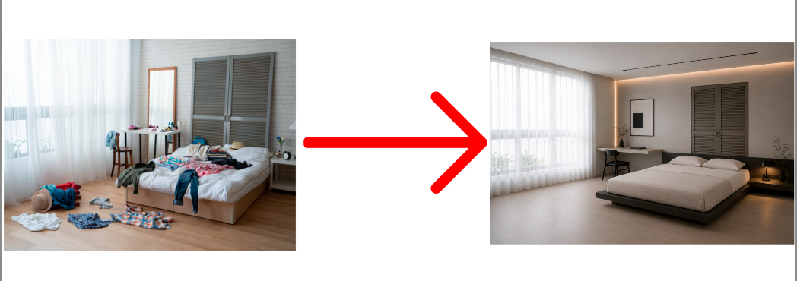
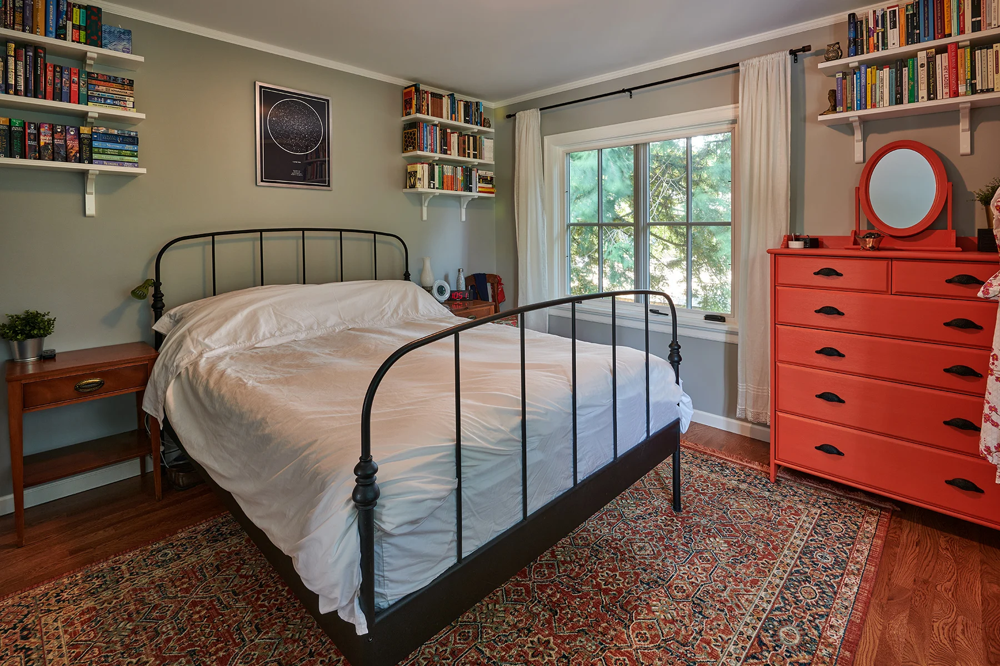
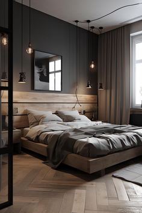
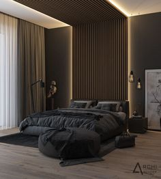

# DeClutter - AI-Powered Interior Design Transformation



**Capstone Graduation Project | CMSE 405 | Fall 2025-26**

DeClutter is an AI-powered interior design application that transforms room photographs into customized design styles using OpenAI's GPT Image 2. Upload a photo of your room and instantly visualize it in different aesthetic styles.

---

##  Features

###  **Style Transformations**
Transform your space into any of these design aesthetics:
- **Minimalist** - Clean, simple, clutter-free
- **Bohemian** - Eclectic, colorful, artistic
- **Industrial** - Raw, exposed materials, urban
- **Modern** - Contemporary, sleek, functional
- **Scandinavian** - Light, natural, cozy
- **Rustic** - Warm, natural wood, cabin feel
- **Spa** - Serene, zen, luxury atmosphere

###  **Supported Room Types**
- Bathrooms
- Bedrooms
- Kitchens
- Living Rooms
- Spa

###  **AI Technologies**
- **GPT Image 2**: Style transfer and room transformation via OpenAI API

---

##  Team

| Name | Role | Responsibilities |
|------|------|------------------|
| **Mohamed Elfaki** | AI/ML Lead | GPT Image 2 integration, prompt engineering |
| **Firas Nazar** | Backend Lead | API development, database, cloud deployment |
| **Saad Ahmed** | Frontend Lead | React web application, UI/UX design |
| **Ahmed Salmi** | Mobile & Integration | React Native app, system integration |

**Supervisor:** Prof. Dr. Hakan Altinçay  
**Institution:** Eastern Mediterranean University  
**Course:** CMSE 405 - Software Design & Development  
**Timeline:** October 2025 - June 2026

---

##  Quick Start

### Installation

**1. Clone the repository**
```bash
git clone https://github.com/DeClutter-Capstone/Main-System.git
cd Main-System
```

**2. Setup Python environment**
```bash
python3 -m venv venv
source venv/bin/activate  # On Windows: venv\Scripts\activate
pip install -r requirements.txt
```

**3. Setup frontend**
```bash
cd frontend
npm install
```

**4. Configure environment variables**

Create `backend/.env`:
```
DB_HOST=localhost
DB_PORT=5432
DB_USER=postgres
DB_PASSWORD=your_password
DB_NAME=DeClutter
OPENAI_API_KEY=your_openai_key
```

Create `frontend/.env.local` with your Firebase config:
```
VITE_FIREBASE_API_KEY=...
VITE_FIREBASE_AUTH_DOMAIN=...
VITE_FIREBASE_PROJECT_ID=...
VITE_FIREBASE_STORAGE_BUCKET=...
VITE_FIREBASE_MESSAGING_SENDER_ID=...
VITE_FIREBASE_APP_ID=...
```

---

##  Running the Application

### Database
```bash
brew services start postgresql@18
```

### Backend API
```bash
cd backend
source ../venv/bin/activate
uvicorn app.main:app --reload --host 0.0.0.0 --port 8000
# API runs on http://localhost:8000
# Interactive docs at http://localhost:8000/docs
```

### Frontend (Web)
```bash
cd frontend
npm run dev
# Web app runs on http://localhost:5173
```

---

##  Milestones

- [x] **M1:** Project setup and initial research (Week 2)
- [x] **M2:** Tested CycleGAN and CUT — switched to FLUX image diffusion model on Replicate
- [x] **M3:** Successfully uploaded customized AI model pipeline to Replicate (FLUX dev)
- [x] **M4:** Switched to GPT Image 2 for higher quality results and better prompt control

---

##  Results

### Sample Transformations

| Original | Minimalist | Modern | Scandinavian |
|----------|------------|--------|--------------|
|  |  |  |  |

---

##  Technology Stack

### AI/ML
- OpenAI GPT Image 2 API

### Backend
- FastAPI
- PostgreSQL

### Frontend
- React + TypeScript + Vite
- Tailwind CSS
- Firebase (Auth + Firestore + Storage)

---

##  Documentation

- [Project Report](docs/CMSE405_PPM_.docx)
- [Final Presentation](docs/presentation.pptx)

---

##  License

This project is for academic purposes as part of CMSE 405/406 coursework at Eastern Mediterranean University.

---

##  Acknowledgments

- **Supervisor:** Prof. Dr. Hakan Altinçay

---

## 📞 Contact

**Mohamed Elfaki** - Project Member  
📧 mohbusiness2400@gmail.com  
🔗 [LinkedIn](https://www.linkedin.com/in/mohamed-elfaki-1-/) | [GitHub](https://github.com/SyntaxNomad)

**Firas Abdelgadir** - Project Member  
📧 firasnazar@gmail.com  
🔗 [LinkedIn](https://www.linkedin.com/in/firas-abdelgadir-98322a247/) | [GitHub](https://github.com/firasnazar2004)

**Project Link:** [DeClutter](https://github.com/DeClutter-Capstone/Main-System)

**Last Updated:** May 2026
